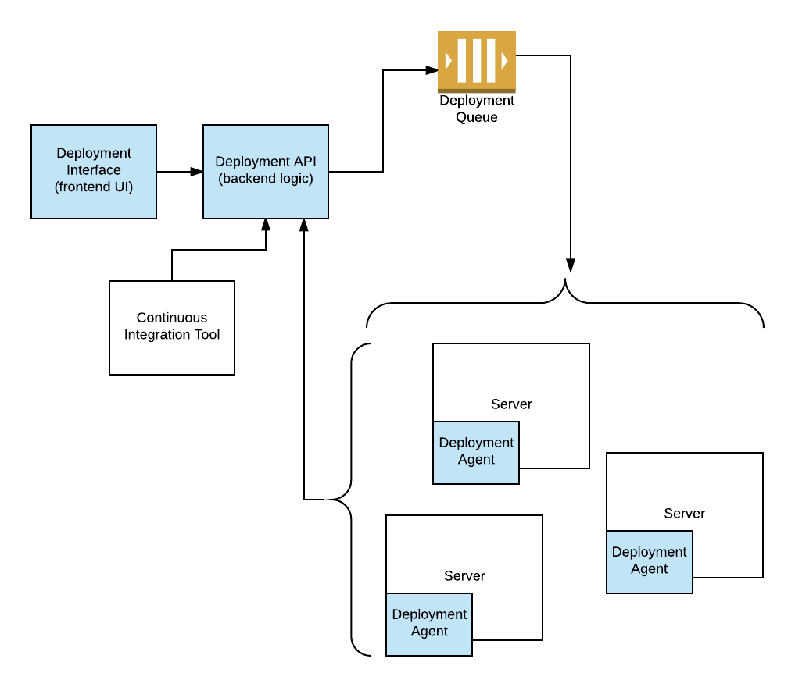

BitEnvoy Agent
====

BitEnvoy is an open source Python code dispatching tool for more secure
deployments.

Setup
====

1. virtualenv -p `which python2` venv
2. . venv/bin/activate
3. pip install -r dev-requirements.txt
4. python connect.py

Below is a simple diagram of what we're trying to achieve:

